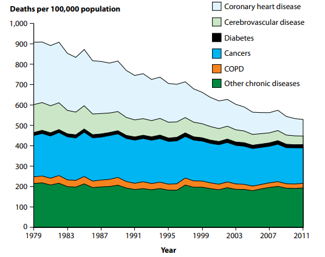
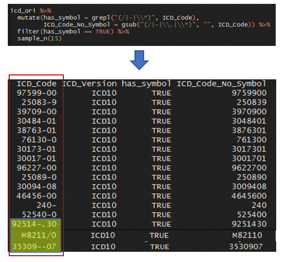
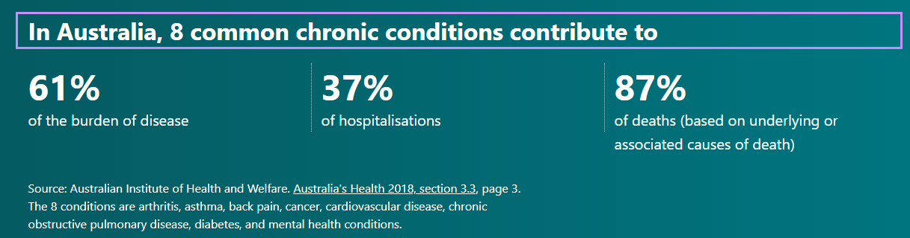
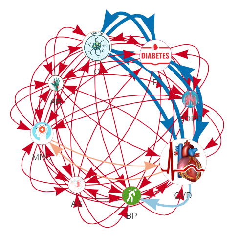
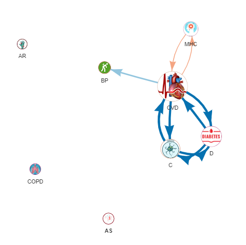
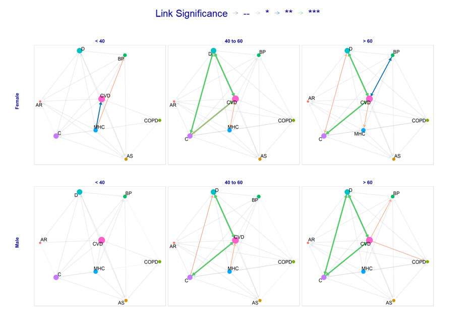
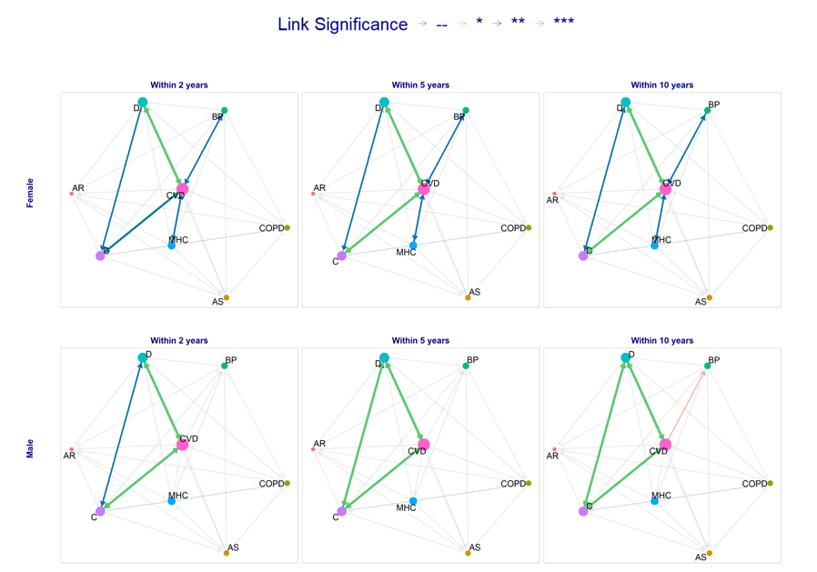
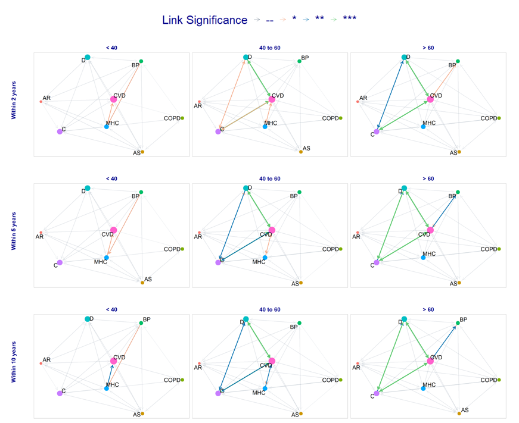

```{r setup, include=FALSE}
options(htmltools.dir.version = FALSE)
```

```{r xaringan-themer, include=FALSE, warning=FALSE}
library(xaringanthemer)
style_duo_accent(
  primary_color = "#1381B0",
  secondary_color ="#FF961C",  #"#FF5733", ## 
  inverse_header_color = "#FFFFFF",
  header_h3_font_size = "1rem",
  footnote_color = "slategray3",
  footnote_font_size = "0.6rem"
)

```

```{r graphs, include=FALSE, warning=FALSE, cache=FALSE}
library(readr)
source("200_CD_visNetwork.R")

cd_df <- read_csv("data/chronic_disease_toICD_code_mapping.csv")

```

# Agenda

**1. Introduction**

**2. Research Aim and Objectives**

**3. Proposed Methodologies**

**4. Progress**

**5. Current Study: Change of Major Chronic Disease Comorbidities with Age, Gender and Developing Years**

**6. Demo: Major Chronic Disease Comorbidities Network**


---
class: inverse, center, middle

# Introduction

---
### Chronic Disease—Australia’s Biggest Health Challenge

_Changes in death rates for chronic diseases, 1979–2011<sup>*</sup>_
<br />
<center>

</center>
<br />

.footnote[
[*] Chapter 4 – Leading types of ill health; Australia's health 2014(https://www.aihw.gov.au/getmedia/8f7bd3d6-9e69-40c1-b7a8-40dca09a13bf/4_2-chronic-disease.pdf.aspx)
]

---
class: inverse, center, middle

# Research Aim and Objectives

---
### To build a framework to predict chronic disease trajectory by using insurance claim data in conjunction with other linkable datasets

--
- How the gender, age and years of development impact the comorbidity of common chronic diseases?

<br />

--
- What will be comorbidities progression network for any specific chronic disease?

<br />

--
- What will be the most multimorbidity combination between the most common and concerned chronic diseases? 

<br />

--
- Can we predict the probability of next possible disease or comorbidity based on the current health record variables?

<br />

--
- Can we estimate and forecast the common chronic disease prevalence within a specific year based on the current status quo?


---
class: inverse, center, middle

# Proposed Methodologies

---
### Network Analysis, Convolutional neural network (CNN) and Hidden Markov Models(HMMs)

--
- Using network analysis to extract and derive the attributes for each chronic disease node, like betweenness, closeness, community clusting and PageRanking etc.

<br />

--
- A brand new idea is proposed in this research by supplying variable matrix for each different period as one channel into a CNN model

<br />

--
- A traditional state sequence model by using hidden Markov models(HMMs) in conjunction with Viterbi algorithm is also planned to be evaluated. This technique is commonly used in the natural language processing to predict next word of a sentence. However, it is quite novel idea to apply this algorithm for the disease trajectory.


---
class: inverse, center, middle

# Progress

---
### Data Cleansing and Exploratory Data Analysis

- The capture of episode data started on 22 August 1995

- Both ICD-9 and ICD-10-AM<sup>*</sup> are presented in the dataset 

<center>

</center>

.footnote[
[*] Introduced in 1998, ICD-10 Australian Modification (ICD-10-AM) was developed by the National Centre for Classification in Health at the University of Sydney. It is currently maintained by the Australian Consortium for Classification Development.

ICD-10-AM has also been adopted by New Zealand, the Republic of Ireland, Saudi Arabia and several other countries.
]


---
### Chronic Disease Coding Determination

- There is no current agreed clear mapping between chronic disease and ICD code.
- Quan et al.<sup>1</sup> bridged 30 widely adopted Elixhauser comorbidities<sup>2</sup> with ICD-9-CM and ICD-10 code. However, these comorbidity definitions are not exactly matching with the chronic diseases which public health practice normally refers to and Australia most concerns.
- HCUP<sup>3</sup> developed a Chronic Condition Indicator for the International Classification of Diseases based on ICD-10-CM. This database has a clear definition whether a diagnose is chronic or not. However, it is currently in a beta version and it is not widely adopted, particularly in Australia context.

.footnote[
[1] Quan et al., Coding Algorithms for Defining Comorbidities in ICD-9-CM and ICD_10 Administrative Data

[2] Elixhauser etal., Comorbidity Measures for Use with Administrative Data

[3] The Healthcare Cost and Utilization Project (HCUP) is a family of healthcare databases and related software tools and products developed through a Federal-State-Industry partnership and sponsored by the Agency for Healthcare Research and Quality (AHRQ).
]


---
### 8 Major Australian Concerned Chronic Diseases

8 most popular chronic disease based on the health.gov.au were selected for this research and they are:

-	Arthritis
-	Asthma
-	Back pain
-	Cancer
-	Cardiovascular
-	Chronic obstructive pulmonary disease
-	Diabetes
-	Mental health conditions

<p />

<center>

</center>


---
### Chronic Disease and ICD Code Bridging Table

After combined all considerations, a bridging table is created and manually verified

```{r eval=require('DT'), tidy=FALSE, echo=FALSE}

DT::datatable(
  cd_df,
  fillContainer = FALSE, filter = 'top', options = list(pageLength = 5)
)
```


---
class: inverse, center, middle

# Current Study: Change of Major Chronic Disease Comorbidities with Age, Gender and Developing Years


---
### Change of Chronic Disease Comorbidity Overall


.pull-left[

_All links included_


]

--

.pull-right[

_Only significant links_


]


---
### Differences between Gender

```{r g_sex,  eval=TRUE, tidy = FALSE, echo = FALSE, warning=FALSE, fig.width = 11, fig.height = 6, dpi = 300}
g_sex

```

---
### Differences between Age Group

```{r g_age,  eval=TRUE, tidy = FALSE, echo = FALSE, warning=FALSE, fig.width = 11, fig.height = 6, dpi = 300}
g_age

```

---
### Differences between Years of Development

```{r g_year,  eval=TRUE, tidy = FALSE, echo = FALSE, warning=FALSE, fig.width = 11, fig.height = 6, dpi = 300}
g_year

```

---
### Differences between Gender and Age Group



---
### Differences between Gender and Developing Years




---
### Differences between Age Group and Developing Years



---
class: inverse, center, middle

# Demo: Major Chronic Disease Comorbidities Network

---

### An Online Interactive App for Visualization (https://tinyurl.com/cdgraph)

<iframe src="https://tinyurl.com/cdgraph" width="100%" height="900" frameBorder="0"></iframe>

---

class: center, middle

# Thank You!


